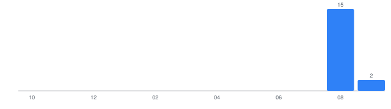

# My LeetCode Journey

An automatically maintained archive of my LeetCode solutions, synced automatically every 6 hours by [`automation/sync.py`](automation/sync.py) (see [`.github/workflows/sync.yml`](.github/workflows/sync.yml)). Everything below the line is regenerated on every sync — see a problem's own README for where to add personal notes.

<!-- LC-SYNC:README-AUTO:START -->

## 📊 LeetCode Dashboard

_Last synced: 2026-08-28 16:57 IST_

### Overall Progress

| Metric | Count |
| --- | --- |
| Unique problems solved | **15** |
| Total submissions | 60 |
| Accepted submissions | 19 |
| Failed submissions | 41 |

### Difficulty

| Difficulty | Solved | % | |
| --- | --- | --- | --- |
| Easy | 15 | 100.0% | `████████████████████` |
| Medium | 0 | 0.0% | `░░░░░░░░░░░░░░░░░░░░` |
| Hard | 0 | 0.0% | `░░░░░░░░░░░░░░░░░░░░` |

### Languages

| Language | Solved | % |
| --- | --- | --- |
| C | 12 | 80.0% |
| Python | 2 | 13.3% |
| Bash | 1 | 6.7% |

### Streak

🔥 **Current streak:** 3 day(s)  
🏆 **Longest streak:** 4 day(s)

### Recent Problems

| Problem | Difficulty | Language | Status | Date |
| --- | --- | --- | --- | --- |
| [Smallest Missing Integer Greater Than Sequential Prefix Sum](problems/2996-smallest-missing-integer-greater-than-sequential-prefix-sum/) | Easy | C | Accepted | Aug 28, 2026 |
| [Two Sum](problems/0001-two-sum/) | Easy | C | Accepted | Aug 27, 2026 |
| [Linked List Cycle](problems/0141-linked-list-cycle/) | Easy | C | Accepted | Aug 26, 2026 |
| [Tenth Line](problems/0195-tenth-line/) | Easy | Bash | Accepted | Aug 26, 2026 |
| [Happy Number](problems/0202-happy-number/) | Easy | C | Accepted | Aug 23, 2026 |
| [Merge Two Sorted Lists](problems/0021-merge-two-sorted-lists/) | Easy | C | Accepted | Aug 22, 2026 |
| [Kids With the Greatest Number of Candies](problems/1431-kids-with-the-greatest-number-of-candies/) | Easy | C | Accepted | Aug 19, 2026 |
| [Plus One](problems/0066-plus-one/) | Easy | C | Accepted | Aug 19, 2026 |
| [Longest Common Prefix](problems/0014-longest-common-prefix/) | Easy | C | Accepted | Aug 19, 2026 |
| [Palindrome Number](problems/0009-palindrome-number/) | Easy | C | Accepted | Aug 16, 2026 |

### Weekly / Monthly / Yearly Progress

- This week: **4** unique problem(s) solved
- This month: **15** unique problem(s) solved
- This year: **15** unique problem(s) solved

### Monthly Activity

### Topics

Array (6), Hash Table (5), Math (5), String (4), Linked List (2), Recursion (2), Bit Manipulation (2), Two Pointers (2), Floyd's Cycle Finding Algorithm (2), Trie (1), Stack (1), Bracket Sequences (1)

<!-- LC-SYNC:README-AUTO:END -->
