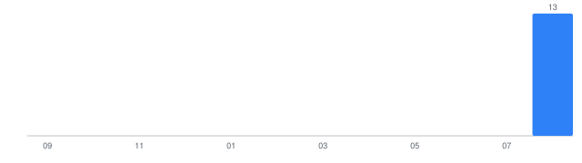

# My LeetCode Journey

An automatically maintained archive of my LeetCode solutions, synced automatically from my submissions by [`sync.py`](sync.py) (see [`.github/workflows/sync.yml`](.github/workflows/sync.yml)). Everything below the line is regenerated on every sync — see a problem's own README for where to add personal notes.

<!-- LC-SYNC:README-AUTO:START -->

## 📊 LeetCode Dashboard

_Last synced: 2026-08-26 13:07 IST_

### Overall Progress

| Metric | Count |
| --- | --- |
| Unique problems solved | **11** |
| Total submissions | 44 |
| Accepted submissions | 13 |
| Failed submissions | 31 |

### Difficulty

| Difficulty | Solved | % | |
| --- | --- | --- | --- |
| Easy | 11 | 100.0% | `████████████████████` |
| Medium | 0 | 0.0% | `░░░░░░░░░░░░░░░░░░░░` |
| Hard | 0 | 0.0% | `░░░░░░░░░░░░░░░░░░░░` |

### Languages

| Language | Solved | % |
| --- | --- | --- |
| C | 9 | 81.8% |
| Python | 2 | 18.2% |

### Streak

🔥 **Current streak:** 0 day(s)  
🏆 **Longest streak:** 4 day(s)

### Recent Problems

| Problem | Difficulty | Language | Status | Date |
| --- | --- | --- | --- | --- |
| [Happy Number](problems/0202-happy-number/) | Easy | C | Accepted | Aug 23, 2026 |
| [Merge Two Sorted Lists](problems/0021-merge-two-sorted-lists/) | Easy | C | Accepted | Aug 22, 2026 |
| [Kids With the Greatest Number of Candies](problems/1431-kids-with-the-greatest-number-of-candies/) | Easy | C | Accepted | Aug 19, 2026 |
| [Plus One](problems/0066-plus-one/) | Easy | C | Accepted | Aug 19, 2026 |
| [Longest Common Prefix](problems/0014-longest-common-prefix/) | Easy | C | Accepted | Aug 19, 2026 |
| [Palindrome Number](problems/0009-palindrome-number/) | Easy | C | Accepted | Aug 16, 2026 |
| [Length of Last Word](problems/0058-length-of-last-word/) | Easy | Python | Accepted | Aug 16, 2026 |
| [Power of Two](problems/0231-power-of-two/) | Easy | C | Accepted | Aug 16, 2026 |
| [Valid Parentheses](problems/0020-valid-parentheses/) | Easy | C | Accepted | Aug 15, 2026 |
| [Roman to Integer](problems/0013-roman-to-integer/) | Easy | C | Accepted | Aug 15, 2026 |

### Weekly / Monthly / Yearly Progress

- This week: **0** unique problem(s) solved
- This month: **11** unique problem(s) solved
- This year: **11** unique problem(s) solved

### Monthly Activity

### Topics

Math (5), String (4), Array (4), Hash Table (2), Recursion (2), Bit Manipulation (2), Trie (1), Stack (1), Bracket Sequences (1), Linked List (1), Two Pointers (1), Floyd's Cycle Finding Algorithm (1)

<!-- LC-SYNC:README-AUTO:END -->
